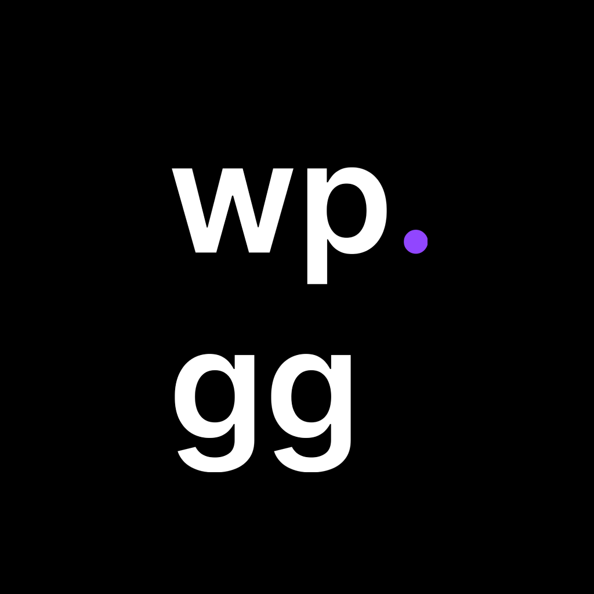
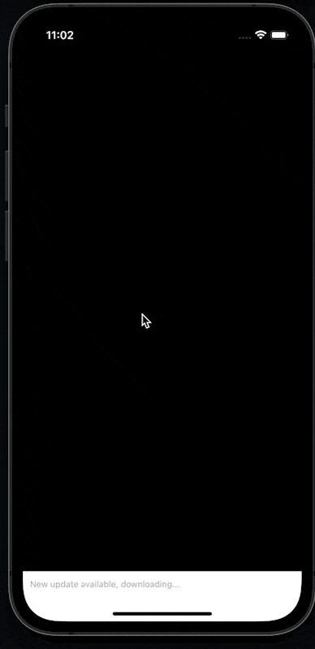
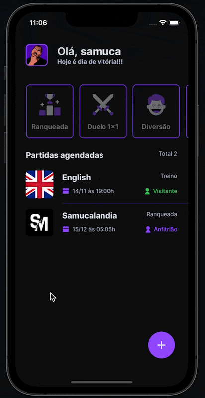
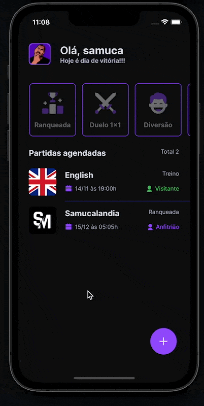

# wp.gg

[](../LICENSE)

<h2 align="left">Topics 📋</h2>

   <p>
   
   - [About 📖](#about-)
   - [Demo 📱](#demo-)
   - [Tech Stack 🛠️](#tech-stack-%EF%B8%8F)
   - [Running the project locally  🔨](#running-the-project-locally--)
   - [How to Contribute 💪🏾](#how-to-contribute-)
   - [Contributors 🚀](#contributors-)

   </p>

---

<h2 align="left">About 📖</h2>

<p align="left">
In thid application you can schedule and register your games and when you will play this game and associated with a discord server.
<br> 
To improve this immersion, you can login with your discord, so that you can schedule the event associated with a server you are on it.
</p>

---

<h2 align="left">Demos 📱</h2>

|                                      Login with Discord                                      |                                    Create the event                                    |                                        Filter and event detail                                         |                                      Logout                                      |
| :------------------------------------------------------------------------------------------: | :------------------------------------------------------------------------------------: | :----------------------------------------------------------------------------------------------------: | :------------------------------------------------------------------------------: |
|  |  |  |  |

---

<h2 align="left">Tech Stack 🛠️</h2>

   <p>

- <a href="https://reactnative.dev/">react-native</a><br>
- <a href="https://www.typescriptlang.org/">typescript</a><br>
- <a href="https://expo.dev/client">expo</a><br>
- <a href="https://styled-components.com/">styled-components</a><br>
- <a href="https://reactnavigation.org/">react-navigation</a><br>
- <a href="https://www.npmjs.com/package/react-native-safe-area-context">react-native-safe-area-context</a><br>
- <a href="https://www.npmjs.com/package/react-native-screens">react-native-screens</a><br>
- <a href="https://www.npmjs.com/package/react-native-svg">react-native-svg</a><br>
- <a href="https://callstack.github.io/react-native-testing-library/">@testing-library/react-native</a><br>
</p>

---

<h2 align="left">Running the project locally  🔨</h2>

```
First of all, correctly configure the React Native development environment on your machine, see https://reactnative.dev/docs/0.60/enviroment-setup, and the Expo development environment on your machine, see https://efficient-sloth-d85.notion.site/Instalando-Expo-9b0abcb12bd548278e042d00fbde67f2.

- Enter in the main directory:
$ cd wp.gg

- For install server dependencies:
$ npm install

- Run the simulador/emulator:
$ npm run ios

  Or

$ npm run android
```

---

<h2 align="left">How to Contribute 💪🏾</h2>

```
- Fork the project

- Create a new branch with your changes:
$ git checkout -b feat/my-feature

- Save your changes and create a commit message telling you what you did:
$ git commit -m "feat: implement my-feature"

- Submit your changes:
$ git push origin feat/my-feature
```

---

<h2 align="left">Contributors 🚀</h2>

<!-- prettier-ignore -->
<table>
  <tr>
    <td align="center"><a href="https://www.samuelematias.com/"><br /><sub><b>Samuel Matias</b></sub></a><br /><a href="https://www.linkedin.com/in/samuelematias/"title="Code">💻</a><a href="https://twitter.com/samuelematias"title="Design"> 🎨</a></td></td>
</table>
